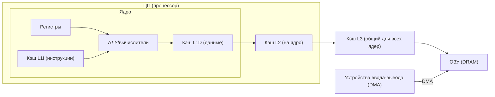
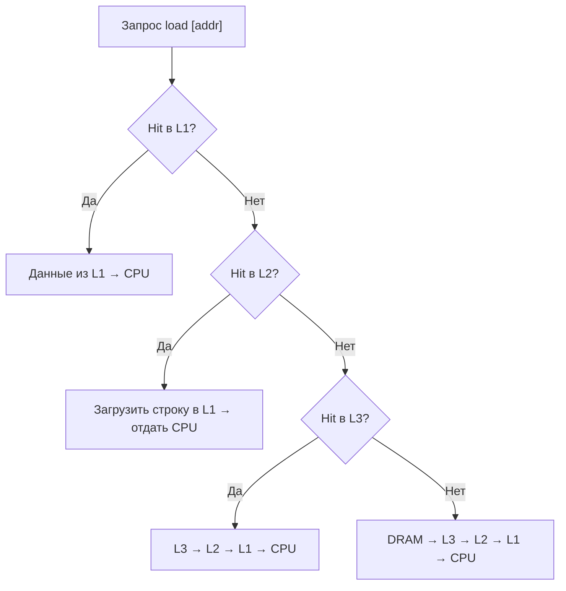
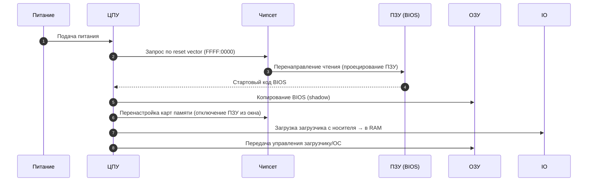
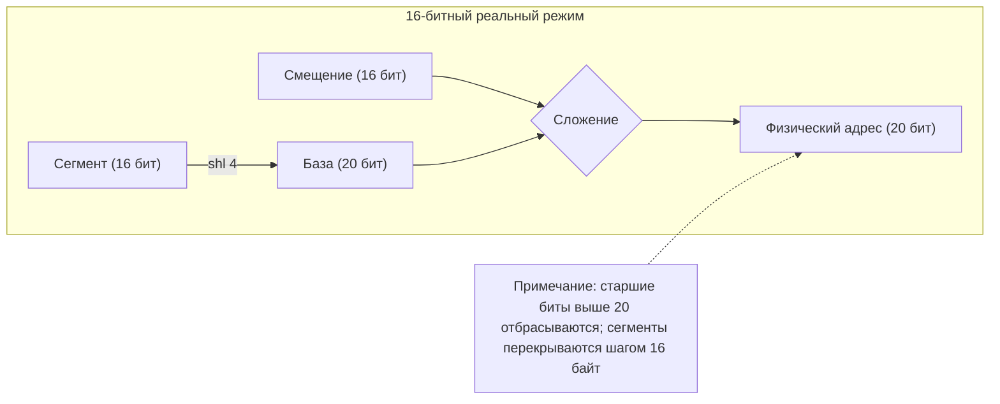

## Системное программирование — Лекция 1

Конспект по теме: архитектура ЦПУ, системная шина, иерархия памяти (регистры — кэш — ОЗУ), когерентность кэшей, DMA, предвыборка и внеочередное исполнение. Исправлены очевидные огрехи распознавания речи.

### Ключевые тезисы
- **Системная шина**: разделяется концептуально на шину адреса, шину данных и шину управления/прерываний. Разрядность адресной шины определяет максимально адресуемый объём памяти.
- **Разрядность**: чаще связана с размером регистров общего назначения и шириной адресного пространства, но это условность: в системе существуют разные адресные пространства (эффективное/линейное/виртуальное/физическое).
- **Тактовая частота**: определяется физическими задержками в логике и длиной проводников; одна команда может занимать от 1 до сотен тактов.
- **Иерархия памяти**: регистры (очень быстро, очень мало) → кэш L1 (разделяют на I/D) → кэш L2 (на ядро) → кэш L3 (общий для всех ядер) → ОЗУ (медленнее, много).
- **Кэш**: ассоциативная память с фиксированными «кэш-строками» (cache line). Используются стратегии вытеснения (практически: разновидности LRU/Random), уровни ассоциативности (обычно 4–16‑way), политика записи часто отложенная (write‑back) с инвалидизацией.
- **Когерентность**: при записи в один кэш остальные должны увидеть консистентное состояние (инвалидируются/обновляются строки на других ядрах; протоколы уровня MESI/MOESI по сути).
- **DMA**: устройства ввода‑вывода могут писать/читать напрямую из ОЗУ, минуя ЦПУ, что требует управления когерентностью кэшей (инвалидировать/не кэшировать буферы).
- **Предвыборка и выравнивание**: предикторы подтягивают следующие кэш‑строки; невыравненные данные часто вызывают двойные обращения к памяти.
- **Внутренняя параллельность**: внеочередное исполнение (out‑of‑order), несколько исполнительных блоков; независимые инструкции выполняются, пока другие ждут память.

### Модель аппаратной платформы


### Шины и разрядность
- **Шина адреса**: ширина в n бит задаёт потенциальный объём адресуемой памяти: 2^n байт. Примеры: 20 бит → 1 MiB (ранние x86), 32 бит → 4 GiB, 36 бит → 64 GiB, современные x86‑64 используют физические адреса порядка десятков бит (в лекции — «≈53 бита» как ориентир, что «хватает с большим запасом»).
- **Шина данных**: определяет, сколько данных можно передать за такт. Исторически 8/16 бит; затем 32/64 бита. Увеличение ширины повышает пропускную способность, но усложняет схемотехнику и энергопотребление.
- **Шина прерываний/управления**: сигналы рукопожатий, запросы прерываний и др.

Привязка «разрядности процессора» — условна: связана и с шириной регистров общего назначения, и с адресными пространствами, но внутри платформы сосуществуют разные ширины.

### Тактовая частота и синхронизация
- Тактовый генератор задаёт частоту работы узлов; задержки по проводникам и логике ограничивают максимум.
- Операции синхронизируются по фронтам такта; одни инструкции заканчиваются за 1–2 такта, другие ждут десятки/сотни тактов из‑за обращений в память.

### Иерархия памяти: размеры и скорость (порядки)


Замечания:
- L1 часто разделяют на кэш инструкций (L1I) и кэш данных (L1D), чтобы они не вытесняли друг друга.
- L2 обычно привязан к ядру; L3 — общий между ядрами.
- По площади на кристалле кэши занимают значимую долю, иногда больше, чем вычислительные блоки.

### Как работает кэш
- **Кэш‑строка (cache line)** — фиксированный блок памяти, минимальная единица обмена между ОЗУ и кэшем. На современных x86 обычно 64 байта; концептуально — «строка фиксированного размера».
- **Поиск**: ассоциативная память. Адрес разбивается на тэг/индекс/смещение. Уровень ассоциативности (n‑way) задаёт число позиций в наборе.
- **Промах (miss)**: при отсутствии строки запускается чтение из следующего уровня (L1→L2→L3→ОЗУ), затем строка размещается в кэше с возможным вытеснением.
- **Вытеснение**: на практике упрощённые эвристики (разновидности LRU/Random) из‑за аппаратных ограничений.
- **Запись**: часто используется write‑back (задержка записи в ОЗУ; строки помечаются «грязными»), с инвалидизацией у других ядер.

Последовательность обращения на чтение:


### Когерентность кэшей (многопоточность/многоядерность)
- При записи ядро помечает/инициирует обновление состояния соответствующей строки на других ядрах: чужие копии инвалидируются или переводятся в согласованное состояние.
- Широковещательные/точечные сообщения между ядрами ограничивают масштабируемость: стоимость растёт с числом ядер и объёмом кэшей.
- Гарантируется «минимум корректности» на уровне аппаратуры; строгая синхронизация порядка видимости данных — зона ответственности программы/ОС (барьеры памяти, блокировки, атомики).

### DMA и взаимодействие с кэшем
- Устройства могут читать/писать в ОЗУ напрямую (DMA), минуя ЦПУ. Это ускоряет ввод‑вывод и разгружает процессор.
- Опасность: кэши могут содержать устаревшие копии данных. Решения: использовать некэшируемые буферы; перед DMA‑чтением инвалидировать соответствующие линии; после DMA‑записи обеспечить видимость данных для ЦПУ (очистка/инвалидизация по адресам буферов).

### Предвыборка и выравнивание
- Аппаратная предвыборка подтягивает «следующие вероятные» кэш‑строки при обнаружении последовательных/шаблонных обращений.
- Невыравненные структуры данных (пересекающие границу кэш‑строки) вызывают дополнительные обращения к памяти. Практика: выравнивать структуры/буферы по размеру кэш‑строки.

### Внутренняя параллельность и внеочередное исполнение
- Современные ядра имеют несколько исполнительных устройств; независимые инструкции исполняются, пока другие ждут память.
- Переупорядочивание, переименование регистров и буферы переупорядочивания используют «скрытый» параллелизм.

Пример (независимая от памяти инструкция может идти вперёд):
```asm
mov bx, [ax] ; потенциально ждёт память
inc ax       ; может исполниться сразу (независима)
```

### Исторические/практические ориентиры (по лекции)
- Ранние x86: адресная шина 20 бит → 1 MiB, затем 24/32 бита; позже расширения до 36 бит (~64 GiB), современные физические адреса ещё шире.
- L1: десятки–сотни КБ на ядро (часто раздельно I/D). L2: сотни КБ–1+ МБ на ядро. L3: общий — единицы/десятки МБ.

### Что важно для программиста на низком уровне
- Учитывать локальность данных и кода; стараться работать с буферами, помещающимися в кэш L1/L2.
- Выравнивать горячие структуры и критические буферы по размеру кэш‑строки.
- Минимизировать ложное совместное использование (false sharing) между потоками (разнести горячие данные по разным кэш‑линиям).
- Для буферов DMA — использовать некэшируемые регионы или явно очищать/инвалидировать линии.
- В многопоточном коде — использовать барьеры памяти/атомики для корректной видимости данных.

---

Примечание: термины типа «проводки/проводочки» нормализованы до «линии шины/провода», «чипса» → «чипсет», «радость» → «адрес», «каши/каш» → «кэш», «памяти в спальне» → «в памяти/в регистрах», и т.п. по смыслу лекции.


## Продолжение: загрузка, адресация и сегментные модели x86

### Загрузка ПК: BIOS/чипсет и проецирование ПЗУ
- **Сброс и стартовый код**: после подачи питания процессор начинает исполнение с фиксированного адреса (reset vector). На классических x86 это `CS:IP = FFFF:0000` (физически `0xFFFF0`).
- **Проецирование ПЗУ в адресное пространство**: чипсет на старте отображает диапазон адресов ОЗУ на флеш‑ПЗУ с кодом BIOS/UEFI (чтение разрешено, запись запрещена). Это позволяет ЦПУ «как будто» обращаться к памяти по обычным адресам, получая код из ПЗУ.
- **Shadowing**: BIOS часто копирует свой код в ОЗУ и перенастраивает чипсет так, чтобы чтение шло уже из RAM (быстрее), а ПЗУ больше не отображалось в этот диапазон.
- **Память‑отображённый ввод‑вывод (MMIO)**: устройства могут быть отображены в отдельные диапазоны адресов, чтобы запись/чтение по ним шла не в DRAM, а в устройство. Классический пример — видеопамять текстового режима (`B800:0000`).



### Адресация в реальном режиме (16‑битный режим, real mode)
- **Регистры общего назначения**: 16‑битные `AX BX CX DX SI DI BP SP`.
- **Сегментные регистры**: `CS` (код), `DS` (данные), `SS` (стек), `ES` (+доп. `FS`, `GS` в поздних x86).
- **IP**: указатель инструкции (логически недоступен напрямую; изменяется переходами/вызовами/прерываниями).
- **Флаги (FLAGS)**: меняются АЛУ; проверяются условными переходами/инструкциями.

Типы адресов:
- **Эффективный адрес (EA)**: то, что в квадратных скобках в коде, например `[BX]`, `[BP+SI+disp]`.
- **Логический адрес**: пара `СЕГМЕНТ:СМЕЩЕНИЕ` (например, `DS:EA`).
- **Линейный/физический адрес**: в реальном режиме вычисляется как `segment << 4 + offset` с усечением до 20 бит (окно 1 MiB). Сегменты перекрываются шагом 16 байт.



Примеры по умолчанию для сегментов:
- Память через `BX/SI/DI` адресуется от `DS` (если нет префикса переопределения).
- Доступ через `BP` и операции со стеком (`PUSH/POP/CALL/RET`) используют `SS`.
- Код читается из `CS` (переходы меняют `CS:IP`).

Небольшие примеры:
```asm
; чтение слова по адресу DS:[BX]
mov ax, [bx]

; доступ через BP идёт из SS по умолчанию
mov ax, [bp+4]

; стек использует SS:SP
push ax
pop  bx
```

### Проблемы старой сегментации и мотивация защиты
- Любой 20‑битный физический адрес может иметь множество логических представлений `S:O` (наложение сегментов), что усложняет контроль и защиту.
- Программа могла бы «подстроить» сегмент и получить доступ к чужой памяти. Требуется аппаратная изоляция.

### Защищённый режим (protected mode) и дескрипторы
- Сегменты описываются записями в таблицах (GDT/LDT): база, лимит, атрибуты (права, тип, привилегии).
- Адресация логически идёт через селектор сегмента → дескриптор → база+смещение → линейный адрес. Далее, при включённом страничном механизме, выполняется перевод в физический адрес.
- ОС настраивает сегменты так, чтобы обеспечить защиту и удобство программирования.

### Плоская модель памяти (flat)
- Практика x86‑32/64: все используемые сегменты (`CS/DS/SS/ES/FS/GS`) настроены на базу `0` и лимит `4 GiB` (или максимально возможный). Тогда «смещение» фактически и есть линейный адрес.
- Преимущества: простые указатели (одно значение), легче передавать адреса между кодом/данными/стеком, меньше оговорок на уровне языка/ABI.


Замечания:
- В 64‑битном режиме многие аспекты сегментации «выключены», но `FS/GS` сохраняют роль для баз TLS и системных структур.
- Скорость — не единственная причина плоской модели; ключевое — простота и безопасность.

### Память‑отображённые устройства и защита
- Чипсет маршрутизирует диапазоны адресов на устройства (MMIO). Можно запретить запись в диапазон ПЗУ, переключить окна, перевести часть памяти в некэшируемый режим и т.п.
- При DMA со стороны устройств важно инвалидировать соответствующие кэш‑линии или использовать некэшируемые буферы.

---

Кратко: старт машины обеспечивается чипсетом через проецирование ПЗУ, ранний код работает в реальном режиме с адресацией `segment<<4 + offset` (окно 1 MiB). Далее ОС включает защищённый режим, описывает сегменты дескрипторами и, как правило, настраивает плоскую модель, скрывая сегментацию от прикладного кода.